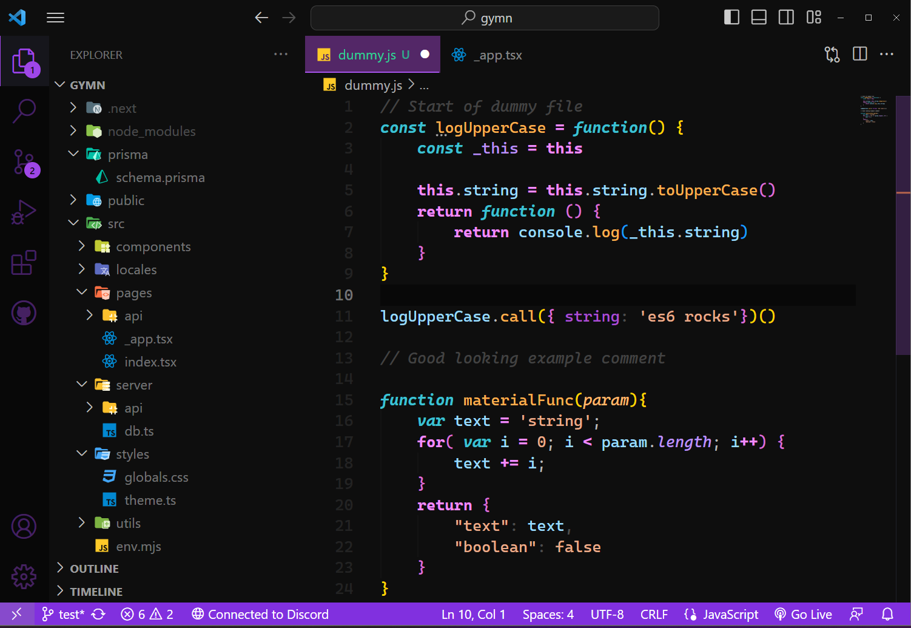

# Purple Dark Horizon

## A fork of "Dark Horizon", with purple theming.

That is a VSCode theme forked from "Dark Horizon", created by <a href='https://github.com/mcagampan/dark-horizon'><i>mcagampan</i></a>, with the colors inspired on <a href='https://marketplace.visualstudio.com/items?itemName=victorfadias.victor-s-dark-horizon'><i>Victor's Dark Horizon</i></a>, but in a purple way.

## For more information

[Theme repository on github](https://github.com/risixdzn/purple-dark-horizon)

[VSCode theming docs](https://code.visualstudio.com/docs/getstarted/themes)

### **Enjoy!**

    

